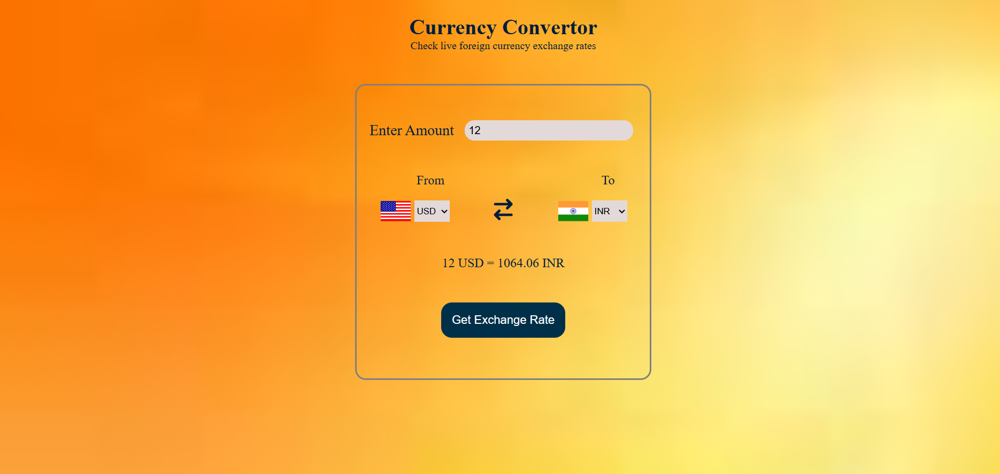

💱 Currency Converter

The Currency Converter is a simple yet powerful web application designed to help users convert values between different world currencies in real time. Built using HTML, CSS, and JavaScript, the project utilizes a currency exchange rate API to fetch the latest conversion rates instantly. The user-friendly interface allows users to select their desired currencies, enter an amount, and view accurate conversions with just one click. The design is clean, responsive, and optimized for both desktop and mobile devices. This project helped me strengthen my understanding of API integration, DOM manipulation, event handling, and asynchronous JavaScript using the Fetch API. It also demonstrates my ability to combine functional logic with an attractive UI, showcasing my skills in frontend development and real-time data handling through APIs.

  

Live Website: https://akash8955.github.io/currency-converter/

